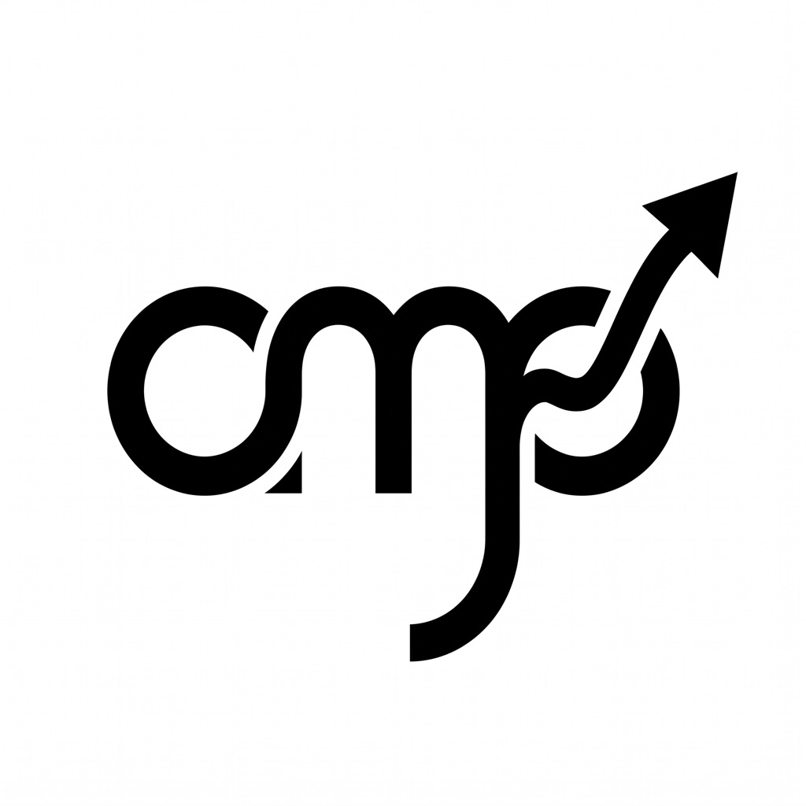

# ompweb

<p align="center">
  
</p>

<p align="center">
  <strong>Web UI-приложение для кодинг-агента <a href="https://github.com/can1357/oh-my-pi">oh-my-pi (omp)</a>.</strong>
</p>

<p align="center">
  <a href="./README.md">English</a> | <a href="./README.zh-CN.md">简体中文</a> | <a href="./README.ja.md">日本語</a> | <a href="./README.ru.md">Русский</a>
</p>

ompweb предоставляет браузерное рабочее пространство для вашего локального omp-рантайма: просмотр сессий с навигацией по ветвям и форками, реалтайм-чат по RPC-протоколу omp, управление моделями / MCP / скиллами, переключение Git worktree и богатый предпросмотр файлов.

<details>
<summary>📸 Иногда скриншоты говорят лучше слов</summary>

| | |
| :---: | :---: |
| Основная рабочая область<br> | Композер новой сессии<br> |
| Развёрнутые детали обработки (вызовы инструментов)<br> | Панель задач композера<br> |
| Меню слэш-команд<br> | Попап информации о сессии / контекста<br> |
| Палитра команд<br> | Модальное окно Git Graph<br> |
| Git Graph — дифф коммита<br> | Вкладка просмотрщика файлов<br> |
| Список сессий (развёрнут)<br> | Просмотрщик архивных сессий<br> |
| Проводник (hover + mention)<br> | Панель суб-агентов (задачи)<br> |
| Git-панель (изменённые файлы)<br> | Хаб Goal & Subagents (развёрнут)<br> |
| Боковая панель чата<br> | Боковой чат (пустое состояние)<br> |
| Панель файлов<br> | Всплывающая подсказка миникарты чата<br> |
| Очередь восстановления при ошибке сервиса<br> | Тема: Light (Warm Paper)<br> |
| Диалог редактирования планировщика<br> | Палитра тем — статичная<br> |
| Палитра тем — текучая<br> | Палитра тем — анимация<br> |
| Палитра тем — шрифт<br> | Настройки — интерфейс и поведение<br> |
| Настройки — безопасность и разрешения<br> | Настройки — параметры ИИ-моделей по умолчанию<br> |
| Настройки — агент и интеллект<br> | Настройки — агенты<br> |
| Настройки — расширения и инструменты<br> | Настройки — нативные настройки OMP<br> |
| Настройки — удалённый доступ<br> | Настройки — центр навыков<br> |
| Настройки — система и обновления<br> | Настройки — поиск<br> |
| Настройки — диагностика и восстановление<br> | Тема: omp Midnight<br> |
| Тема: Oatmeal Latte<br> | Тема: Monokai Pro<br> |
| Тема: Monokai Pro Spectrum<br> | Тема: Omarchy Monokai<br> |
| Тема: Monochrome (Codex)<br> | Тема: Monokai Pro Light Sun<br> |
| Тема: Rosé Pine Dawn<br> | Тема: Harbor<br> |
| Тема: Catppuccin Mocha<br> | Встроенный терминал (открыт)<br> |
| Тема: Nord Arctic<br> | Тема: Kyoto Matcha<br> |
| Тема: OLED Obsidian<br> | Тема: Warm Ember<br> |
| Тема: Antique Vellum<br> | Тема: Dracula Velvet<br> |
| Тема: Pine Forest<br> | Тема: Horizon Navy<br> |
| Тема: Monokai Classic<br> | Тема: Monokai Pro Octagon<br> |
| Тема: Monokai Pro Machine<br> | Тема: Monokai Pro Ristretto<br> |
| Тема: Monokai Pro Light<br> | Тема: One Light<br> |
| Тема: One Dark Pro<br> | Тема: Catppuccin Latte<br> |
| Тема: Gruvbox Dark<br> | Тема: Tokyo Night<br> |
| Тема: Rosé Pine<br> | Моб.: Light (Warm Paper)<br> |
| Моб.: Nord Arctic<br> | Моб.: Oatmeal Latte<br> |
| Моб.: Kyoto Matcha<br> | Моб.: OLED Obsidian<br> |
| Моб.: Monochrome (Codex)<br> | Моб.: Warm Ember<br> |
| Моб.: Antique Vellum<br> | Моб.: Dracula Velvet<br> |
| Моб.: Pine Forest<br> | Моб.: Horizon Navy<br> |
| Моб.: Omarchy Monokai<br> | Моб.: Monokai Classic<br> |
| Моб.: Monokai Pro<br> | Моб.: Monokai Pro Octagon<br> |
| Моб.: Monokai Pro Machine<br> | Моб.: Monokai Pro Ristretto<br> |
| Моб.: Monokai Pro Spectrum<br> | Моб.: Monokai Pro Light<br> |
| Моб.: Monokai Pro Light Sun<br> | Моб.: omp Midnight<br> |
| Моб.: One Light<br> | Моб.: One Dark Pro<br> |
| Моб.: Catppuccin Latte<br> | Моб.: Catppuccin Mocha<br> |
| Моб.: Gruvbox Dark<br> | Моб.: Tokyo Night<br> |
| Моб.: Rosé Pine<br> | Моб.: Rosé Pine Dawn<br> |
| Моб.: Harbor<br> |
</details>

## 🐳 Запуск в Docker

Проект в первую очередь адаптирован для работы в Docker (Linux): `docker-compose.yaml` в корне репозитория собирает образ, примонтирует репозиторий и мапит порты лаунчера. Запуск одной командой:

```bash
docker compose up -d --build
```

затем откройте [http://127.0.0.1:6767](http://127.0.0.1:6767) (пароль — в разделе **Переменные окружения** ниже).
Примечание: по умолчанию compose-файл пробрасывает `c:/users/dev/.omp` в `/root/.omp` внутри контейнера — перед запуском контейнера обновите путь `source:` на каталог `.omp` вашего пользователя (`~/.omp` на Linux, либо `c:/users/{user}/.omp` на Windows), чтобы контейнер использовал ваши существующие учётные данные, сессии и настройки.

Мобильная web-версия — полнофункциональный PWA: добавьте его на домашний экран телефона, и он будет вести себя как нативное приложение.
Сборка и запуск как самостоятельного Windows / Linux / macOS приложения поддерживаются не менее полно.
Форк проекта и его развитие поощряются.

## ⚙️ Порты

Лаунчер пробует порты `SIBLING_PORTS = [30177, 30178, 30179]` (зашиты в `bin/omp-web.js`); `docker-compose.yaml` мапит все три в контейнер. Используйте эти порты, когда агент запускает dev-сервер внутри контейнера, а вам нужно открыть/отладить его в браузере на хосте.

## 🔑 Пароль по умолчанию

Compose-файл по умолчанию задаёт `OMP_WEB_PASSWORD=asdf1234` — введите его на экране входа, либо замените на свой.

## 🔄 Пересборка и перезапуск (репозиторий примонтирован)

Когда репозиторий примонтирован в контейнер (дефолт compose), скрипт `ompweb-rebuild-restart.sh` регистрируется в **Script schedulers** настроек как планировщик *ручного запуска* — удобный способ пересобрать и передеплоить ompweb после того, как ваш агент изменил исходный код. После этого достаточно просто обновить страницу, чтобы подхватить новый билд. Когда новый билд задеплоен и OmpWeb запущен, вы получите уведомление в UI с кнопкой **Refresh page**. Обратите внимание: одновременно работающий dev-сервер ompweb иногда может сделать билд основного инстанса устаревшим.

## 🤖 Agents MCP

Встроенный мультимодельный **Agent MCP** сервер отключён по умолчанию. Включите его (Settings → Extensions & Tools → MCP), если планируете запускать и координировать различных агентов из OMP-агента.

## 🙏 Благодарности и улучшения

Проект включает улучшения, изначально внесённые форками `kahme247` и `37chengshan`, элегантно слитые в кодовую базу с сохранением только полезных функций; большинство исправлений предоставил Splinterjke. Основные улучшения:

- Основные баги с просмотром файлов, странное поведение скроллбара и тому подобное — в основном решено, но часть осталась специально для вас, хе-хе
- Настраиваемые параметры и приоритет сжатия контекста (Context Compaction)
- Большое количество новых тем и палитр (семейство Monokai, Omarchy Monokai, Catppuccin, Rosé Pine, Harbor, omp Midnight, Oatmeal Latte и многие другие) с исправленными surface-токенами и темизированным выделением текста
- Модальное окно Git Graph — визуализация истории репозитория с просмотром diff файлов по коммитам
- Улучшенная RPC / IPC связь, включая восстановление сессий и продолжение ходов после перезапуска сервера
- Исправления пересборки и перезапуска OmpWeb: уведомление о обновлении с явной кнопкой refresh, исключение loopback `/api/ui/refresh`, автоматическая регистрация ручного планировщика
- Улучшения миникарты чата / скроллбара: рельс на всю высоту, градиентный акцентный луч, ограничение ползунка высотой рельса, более крупные hover-подсказки
- Градиентный луч по периметру рамки чат-ввода (по часовой стрелке)
- Единообразные, обобщённые настройки размера шрифта
- Разворачиваемые и масштабируемые секции в левой панели, масштабируемые панели сайдбара / воркбенча
- Функциональность планировщика скриптов (интервал, ежедневно, еженедельно, cron, вручную) с отдельной панелью настроек
- Улучшенные страницы Skill Hub и Agents в настройках — Skill Hub и Agents показывают инстансы не только активного рабочего пространства, а каждого
- Более удачный композер новой сессии (выбор рабочего пространства, плюс-меню вложений, контекстное кольцо)
- Разворачиваемые блоки thinking и detail, инлайн-раскрытие полных вводов инструментов
- Трёхзонный верхний бар с хлебными крошками workspace / session по центру, popover «Session Info», хаб sub-agents в композере
- Удаление лишнего, наведение порядка в layout / отступах и производительности

## 🛠️ Переменные окружения

| Переменная | Описание | Значение по умолчанию / пример |
| :--- | :--- | :--- |
| `PORT` / `-p` / `--port` | Порт сервера | `6767` |
| `OMP_WEB_HOSTNAME` / `-H` / `--hostname` | Хост привязки | `127.0.0.1` |
| `OMP_WEB_PASSWORD` / `--password` | Пароль web-входа (дефолт compose: `asdf1234`) | *(не задан / отключено)* |
| `OMP_WEB_ALLOWED_HOSTS` | Разрешённые не-луупбэк хосты (через запятую) | *(пусто — только луупбэк)* |
| `OMP_WEB_NO_OPEN` | Не открывать браузер автоматически | `0` (`1` — пропустить) |
| `OMP_WEB_OMP_BIN` | Абсолютный путь к бинарнику `omp` | Ищется в `PATH` |
| `OMP_WEB_STT_ENDPOINT` | URL OpenAI-совместимого STT-эндпоинта | _нет (отключено)_ |
| `OMP_WEB_STT_KEY` | API-ключ для STT-эндпоинта | _нет_ |
| `OMP_WEB_STT_MODEL` | Имя модели для STT-эндпоинта | _нет_ |
| `PI_CODING_AGENT_DIR` | Домашний каталог OMP-агента | `~/.omp/agent` |
| `HTTP_PROXY` / `HTTPS_PROXY` | Прокси для серверных запросов | *(системный дефолт)* |

## 📄 Лицензия

Проект распространяется под [лицензией MIT](./LICENSE).
