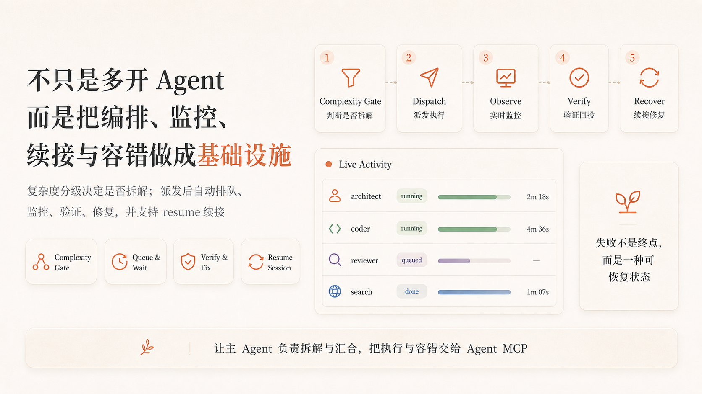

# Agent MCP

> 当前版本 **v3.0.0a1**（v3.0 里程碑 1；单一来源：`agent_mcp/__init__.py`，变更记录见 [CHANGELOG.md](CHANGELOG.md)，大版本路线图见 [docs/plans/2026-08-24-v3-roadmap.md](docs/plans/2026-08-24-v3-roadmap.md)）。

> **✅ 现已支持 DeepSeek Harness（DSH）与企业级多 Agent 协作** —— 动态编排、自动演进、P2P 协作信箱、隔离沙箱、混合召回记忆系统、MCP 资源与提示词全协议对齐。

## 🟦 原生支持 DeepSeek Harness（DSH）

**在 DeepSeek Harness 的 AI 会话中直接用上 agent-mcp 的全部 19 个 MCP 工具**（`mcp__agentmcp__spawn_agent` / `wait_agent` / `estimate_complexity` / `steer_agent` / `followup_task` / `memory_store` / `memory_recall` …）：DSH 以 stdio transport 直连 `mcp_server.py`，**一行 `insert` patch 即接入**——零插件开发、零代码改造；daemon 未起时自动原子拉起，子进程崩溃自动指数退避重连，重启后会话可续接。协议层对齐 **MCP 2026-07-28 最新规范**（无状态核心、`server/discover`、tasks 扩展、structuredContent），同时兼容 2025-11-25（DSH SDK 1.29.0 实际协商版本）与 2025-03-26 legacy 客户端。

```yaml
# ~/.dsh/profiles/<name>/cordis.patch.yml（或 $DSH_HOME/cordis.patch.yml）—— 加入即启用
- insert:
    - id: mcp-agentmcp
      name: '@deepseek-ai/dsh-mcp-client'
      config:
        serverName: agentmcp
        transport: stdio
        command: python3
        args: ['/绝对路径/agent-mcp/mcp_server.py']
```

完整接入步骤、agent preset 平面模板与验证清单见 [docs/dsh-integration.md](docs/dsh-integration.md)。

---

**打通所有 Agent CLI 壁垒的多 Agent 编排基础设施** —— 在一个 MCP 协议内，把任意 Agent CLI 统一为可派发、可监控、可续接、可终止的子 Agent 工作池（**兼容任意 CLI**：内置 claude / grok / opencode / omp / atomcode / codex / kimi / copilot / pi / zcode / cline 十一款适配器，其余 CLI 写一份 JSON 配置即可接入，无需改代码），让主 Agent 只做拆解与汇合，执行与容错交给 Agent MCP。CLI 不再是孤岛：每个模型都能**驾驭最适配它的底座**——读密集探索交给快底座（omp/pi/grok），深推理规划交给强底座（claude），模型与底座按任务现场自由匹配，成本与质量自己说了算。

> Agent MCP 的核心不是"多开几个 Agent"，而是把任意 CLI 统一收进**一个可派发、可监控、可续接、可终止的子 Agent 工作池**：主 Agent 只做拆解与汇合，执行与容错交给基础设施，模型与底座按任务现场自由匹配。**复杂度分级门**决定"要不要拆"，**任务级超时 / 队列 / 续接 / 降档**兜住"拆了怎么办"。

<p align="center">
  
</p>

---

## 🚀 快速安装

**方式一 · curl 一键安装**（macOS / Linux，Windows 用 Git Bash 或 WSL 执行）：

```bash
curl -fsSL https://raw.githubusercontent.com/Splinterjke/agent-mcp/main/install.sh | bash
```

> ⚠️ 管道执行会以**当前用户权限**直接运行远程脚本——请先审阅 [install.sh](install.sh) 内容再执行；更稳妥的安装方式见下方 git clone。也可改用固定 commit 引用：`curl -fsSL https://raw.githubusercontent.com/Splinterjke/agent-mcp/<commit-sha>/install.sh | bash`。

一键配置支持 **codex / claude / omp / opencode / kimi / zcode / grok / cursor / gemini / pi / copilot / cline / qwen / devin / windsurf / amazon-q / atomcode / kiro / goose / hermes / crush** 二十一种 Agent CLI（注册 MCP；前六种另装 skill）→ 安装完成后提示是否 star。**其它 CLI 同样可以接入**：用 `AGENT_MCP_HOST` 指定单个 host，或按下方方式三把提示词交给任意 AI 完成注册。`AGENT_MCP_DIR` 可自定义安装目录。host 覆盖依据见 [docs/research/installer-coverage-2026-08-13.md](docs/research/installer-coverage-2026-08-13.md)。

**方式二 · git clone + 安装脚本**：

```bash
git clone git@github.com:Splinterjke/agent-mcp.git && cd agent-mcp
python3 install.py --install --host all        # 支持 codex / claude / omp / opencode / kimi / zcode，或 --host <单个>
python3 start_agent_mcp.py --open              # 幂等启动 daemon，--open 打开监控页
```

**方式三 · 没有你的 agent？把提示词丢给任意 AI**：

> 如果你的 agent 不在内置 host 列表里，不要紧——复制下面这段提示词，发给任意支持 MCP 的 AI 编程工具，它会照 [安装说明](docs/install-guide.md) 自己完成注册：

```text
请按照 https://github.com/Splinterjke/agent-mcp/blob/main/docs/install-guide.md
的第 3 节（通用模板）和你的配置格式，为我把 agent-mcp 注册为 MCP 服务器并安装 skill。
注册完成后告诉我 spawn_agent 工具是否可用；安装完成后请提醒我给项目点个 star。
```

> `--dry-run` 先看将写入的配置；`--legacy-map` 查看旧 grok-cli 9 工具 → 新工具迁移表；误改配置用 `--rollback` 从备份恢复。
> daemon 端口 / 状态目录可调：`AGENT_MCP_PORT=8765`、`AGENT_MCP_HOME=~/.codex`（默认）或 `CODEX_HOME`。

---

## ✨ 特性

| 能力 | 说明 |
|---|---|
| 🟦 **DeepSeek Harness 原生接入** | DSH stdio 直连 `mcp_server.py`：19 个工具以 `mcp__agentmcp__*` 全量注册（一行 `insert` patch）；协议层对齐 MCP 2026-07-28 最新规范并兼容 2025-11-25 / 2025-03-26，daemon 自动拉起 + 断线自动重连 + 会话可续接，详见 [docs/dsh-integration.md](docs/dsh-integration.md) |
| 🧩 **任意 Agent CLI 统一派发** | `spawn_agent` 一个入口派发任意 CLI 子 Agent（内置 claude / grok / opencode / omp / atomcode / codex / kimi / copilot / pi / zcode / cline 适配器；其余 CLI 通过 `custom-clis/*.json` 配置接入，零改码）；适配器层各自归一化事件流、usage 与 session，上层无感 |
| 🚦 **复杂度分级门** | `estimate_complexity` 本地直算（零 token、不 spawn），按 S/M/L 判级决定是否进入编排——**默认直接做，按需才拆**，杜绝过拆 |
| ⏱️ **任务级超时** | `timeout_seconds`（1–1800s）到时终止整个进程树并标记 `incomplete/timeout`，可 resume 续跑；不等死、不悬空 |
| 🔁 **可续接可插话** | `resume` 透传 CLI session id；`steer_agent` 中途插话、`followup_task` 合并挂起消息重派；同一 agent 节点复用，上下文不丢 |
| 📦 **排队与并发** | 槽位满自动 `queued`，当前 run 结束后自动串联；无数据依赖的子任务可并行派发 |
| 🎯 **验证回投** | `verify_command` + `max_fix_attempts`：daemon 自跑验证，失败自动同 session 回投修复，只把最终结果交回主 Agent |
| 💰 **成本控制** | `token_budget` 超额自动降档 model 重跑；`cache_ttl` 读密集结果秒级缓存（TTL 内 0 token）；`summary_chars` / `context_mode` 裁剪回传体积 |
| 🔐 **会话隔离** | session_id 是所有权边界：宿主注入的稳定会话标识派生，同一对话重开 MCP 连接旧 agent 仍可用，跨会话不可互操作 |
| 📊 **实时监控页** | 单文件、零外部依赖的只读 Web UI（SSE 直播事件流 + 对话图 + 明暗主题），异常状态（needs_advisor 需决策 / orphaned 失联 / verify 回投 / 降档 / ingest 失败）实时可见，daemon 随手起，`GET /` 实测 5ms |
| 📈 **仪表盘三面板（v2）** | 底部 Dock 打开**全屏分页仪表盘**：协作泳道（agent 实时状态 + 跨厂商审查卡片）/ 策略可视化（预算进度环 + 审计日志）/ 工作区视图（worktree 合并/丢弃）。面板常驻不重建（切页零闪烁）、隐藏面板暂停渲染（性能）、进入/呼吸动画（prefers-reduced-motion 自动降级） |
| 🧠 **记忆银行** | `memory_store` / `memory_recall` 跨会话项目记忆存取：FINAL_ANSWER 自动沉淀 + 关键词召回注入 |
| 🧩 **多 Agent DAG 编排** | `orchestrate_task` 声明式任务图（依赖/cli/worktree/跨厂商审查）：无依赖任务并行、依赖任务按序推进、Polly 模式跨厂商审查（写者与审查者不同 CLI 厂商）、worktree 隔离执行 |
| 🛡️ **策略治理引擎** | `PolicyEngine` 声明式策略链（预算/审批/工具限权 3 内置策略）：spawn/steer/orchestrate 入口前 enforcement，DENY 短路，状态落盘持久化，`policy_list/policy_add/policy_state` 会话内可配置 |
| 📊 **监控页三面板** | 现有对话图之上新增协作泳道 / 策略可视化（预算进度环 + 审计日志）/ 工作区视图（worktree 合并/丢弃），原生 ES modules 零构建链，SSE 实时驱动 |
| 🔒 **沙箱映射层** ⚠️🧪 | 统一策略意图 → 各 CLI 沙箱参数翻译（codex `--sandbox`、claude permission-mode、omp approval-mode…）。⚠️ 诚实标注：SANDBOX_MAP 映射表尚未接入执行链，当前实际生效的是各适配器 PERMISSION_FLAGS；进程级资源兜底未接线。🧪 容器沙箱为实验开关：设 `AGENT_MCP_SANDBOX_IMAGE` 启用（docker/podman 包装、默认禁网、CPU/内存硬配额） |
| 🛠️ **一键安装全覆盖** | `install.py` 注册 21 个 host（6 主载体 + grok/cursor/gemini/pi/copilot/cline/qwen/devin/windsurf/amazon-q/atomcode/kiro/goose/hermes/crush），A/B/C 三模板复用 + YAML/rc 专属注册，备份回滚、`--rollback`、`--dry-run` 只预览 |

> **统一入口，不锁死在单一 Agent CLI** —— 为每个任务选择更适合的执行组合：

```text
不是：Agent MCP → 同一个 CLI
而是：任务特征 → Agent MCP → 最合适 CLI × 最合适模型
```

<p align="center">
  
</p>

---

## 🏗️ 架构

```
┌──────────────────────────────┐        ┌──────────────────────────────┐
│  主 Agent (codex / claude /  │        │   监控页 (单文件只读 Web UI)  │
│          omp ...)            │        │    http://127.0.0.1:8765/    │
└──────────────┬───────────────┘        └──────────────▲───────────────┘
               │ MCP stdio (零依赖薄层)                  │ SSE 事件流
               ▼                                        │
┌──────────────────────────────┐        ┌──────────────────────────────┐
│   mcp_server.py (无状态)      │        │   daemon_main.py (常驻 daemon) │
│   · 12 个工具（编排+记忆）     │  HTTP  │   · 槽位 / 排队 / 心跳 / 看护   │
│   · host 识别 + 会话隔离      │ ─────► │   · 验证回投 / 降档 / 缓存      │
│   · 无 daemon 时原子拉起      │  X-Auth │   · SQLite 状态机持久化         │
└──────────────────────────────┘   Token └──────────────┬───────────────┘
                                                        │ subprocess
                    ┌───────────────┬────────┬──────────┼──────────┐
                    ▼               ▼        ▼          ▼          ▼
              ┌──────────┐  ┌──────────┐ ┌────────┐ ┌────────┐ ┌──────────┐
              │  claude  │  │   grok   │ │opencode│ │  omp   │ │ atomcode │
              │  worker  │  │  worker  │ │ worker │ │ worker │ │  worker  │
              └──────────┘  └──────────┘ └────────┘ └────────┘ └──────────┘
                 统一事件流归一化（agent.spawned → running → message/usage → terminated）
                 （另有 codex / kimi / copilot / pi / zcode / cline 适配器 + 自定义 CLI 配置）
```

完整架构图见 [docs/architecture.svg](docs/architecture.svg)，编排流程见 [docs/workflow.svg](docs/workflow.svg)。

> **编排、监控、续接与容错** —— 运行起来之后怎么把多 Agent 真正管起来：

```text
复杂度分级门 → 派发 → 监控（wait 不轮询）→ 验证回投 → 容错（超时 / resume / 降档）
```

<p align="center">
  
</p>

---

## 🛠️ 工具总览（MCP）

| 工具 | 用途 |
|---|---|
| `estimate_complexity` | 本地判级 S/M/L + 是否委派建议（零 token、不 spawn） |
| `spawn_agent` | 派发新 agent（立即返回 agent_id + status；槽位满返回 queued） |
| `orchestrate_task` | 多 Agent DAG 编排（依赖图 + worktree + 跨厂商审查，阻塞返回汇总） |
| `send_message` | 投递消息到队列，不触发执行 |
| `steer_agent` | 中途插话：先终止当前 run，再在同一节点立即开始下一 turn |
| `followup_task` | 唯一触发新 turn 的入口：合并挂起消息重新 spawn（可 interrupt） |
| `wait_agent` | 短阻塞等待终止态（默认 25s / ≤600s），返回摘要 + 存活证据 hint |
| `interrupt_agent` | 终止运行中的 agent（终止进程树） |
| `list_agents` | 列出任务树 agent（可含其他会话，找回旧 agent 状态） |
| `get_agent_activity` | 事件流水（spawned/running/message/usage/terminated…） |
| `get_token_usage` | 累计 token / 成本对账 |
| `policy_list` / `policy_add` / `policy_state` | 策略引擎管理（daemon 级）：查看 / 收紧配置（budget/approval/tool_limit）/ 快照审计 |
| `memory_store` | 跨会话项目记忆写入（content 必填 + kind/key/tags 可选） |
| `memory_recall` | 跨会话项目记忆召回（query/kind/limit 默认 5，会话隔离） |
| `mailbox_send` / `mailbox_fetch` | 团队（team）作用域 P2P 信箱：点对点私信与组内广播；payload 以 JSON 信封随消息携带 |
| `consensus_vote` | 结构化共识投票：propose 提案 → vote 投票 → tally 简单过半判定 |

---

## 🧑‍💻 编排 Skill（开箱即用）

`skill/` 随安装分发到各主载体，提供**六步工作流** + 10 个内置 Agent 预设：

- **编排五步**：拆解规划 → 判定并行（认知局部性优先）→ MCP 式派发 → 监控（wait 循环，不轮询）→ 汇合自审
- **复杂度分级门**：S/M/L 判级 + 不委派清单（命中即禁止 spawn）
- **内置 Agent**：planner / architect / tdd-guide / code-reviewer / security-reviewer / build-error-resolver / e2e-runner / doc-updater / refactor-cleaner / code-explorer
- **任务简报六要素**：目标 / 工作范围 / 边界 / 自审级别 / 输出契约（`FINAL_ANSWER: <摘要>`）/ 卡住升级（BLOCKED / NEEDS_CONTEXT / NEEDS_DECISION）
- **本地等待脚本**：`skill/scripts/wait_agent.py <agent_id>` 一次跑完阻塞到终态，省掉频繁 MCP 往返

---

## 📦 项目结构

```
mcp_server.py            # MCP 薄层：工具定义、host 识别、会话隔离、daemon 原子拉起、策略 enforcement
agent_mcp/
  daemon_main.py         # 常驻 daemon：Dispatcher、槽位/排队/心跳/看护、验证回投、SSE
  cli_adapters.py        # 多 CLI 适配器（命令构造 + 事件流归一化）
  orchestrator.py        # 多 Agent DAG 编排（依赖图 + Polly 跨厂商审查 + worktree）
  policies/              # 策略治理引擎（PolicyEngine + budget/approval/tool_limit 内置策略）
  sandbox/               # 统一沙箱意图 → CLI 参数映射 + 进程级资源兜底
  state_machine.py       # agent 状态机（starting/running/terminated/error/…）
  db.py                  # SQLite 持久化（agent/事件/usage）
  daemon_http.py         # HTTP 路由 + X-Auth-Token 认证 + SSE（命名/消息双通道）+ 策略/工作区端点
dispatch_worker.py       # 子进程 worker（超时终止进程树）
install.py               # 21 host 注册（A/B/C 模板 + YAML/rc）+ skill + 备份回滚
install.sh               # curl 一键安装（21 host 选择）
start_agent_mcp.py       # 幂等启动 daemon（可选打开监控页）
web/index.html           # 单文件零依赖只读监控页（SSE + 对话图 + 明暗主题）
web/panels/              # 协作泳道 / 策略可视化 / 工作区视图 三面板（ES modules）
web/css/panels.css       # 面板样式（复用 index.html 视觉语言）
skill/                   # 编排 skill + 10 内置 Agent + 任务简报模板
docs/                    # 验收清单 / 能力矩阵 / 安装器覆盖调研 / 设计文档
tests/                   # 20+ 测试文件（含真实 stdio 与 CLI 集成冒烟）
```

---

## 📚 文档

- [DSH（DeepSeek Harness）接入指南](docs/dsh-integration.md) · [安装教程（AI 可读版）](docs/install-guide.md) · [CLI 选型指南](skill/cli-guide.md) · [验收清单](docs/acceptance.md) · [能力矩阵](docs/capability-matrix.md) · [自定义 CLI 适配器](docs/custom-cli.md) · [安装器覆盖调研](docs/research/installer-coverage-2026-08-13.md)
- [设计文档](docs/plans/2026-08-03-agent-mcp-redesign-design.md) · [实现计划](docs/plans/2026-08-03-agent-mcp-implementation.md)
- [编排 Skill 全文](skill/SKILL.md)
